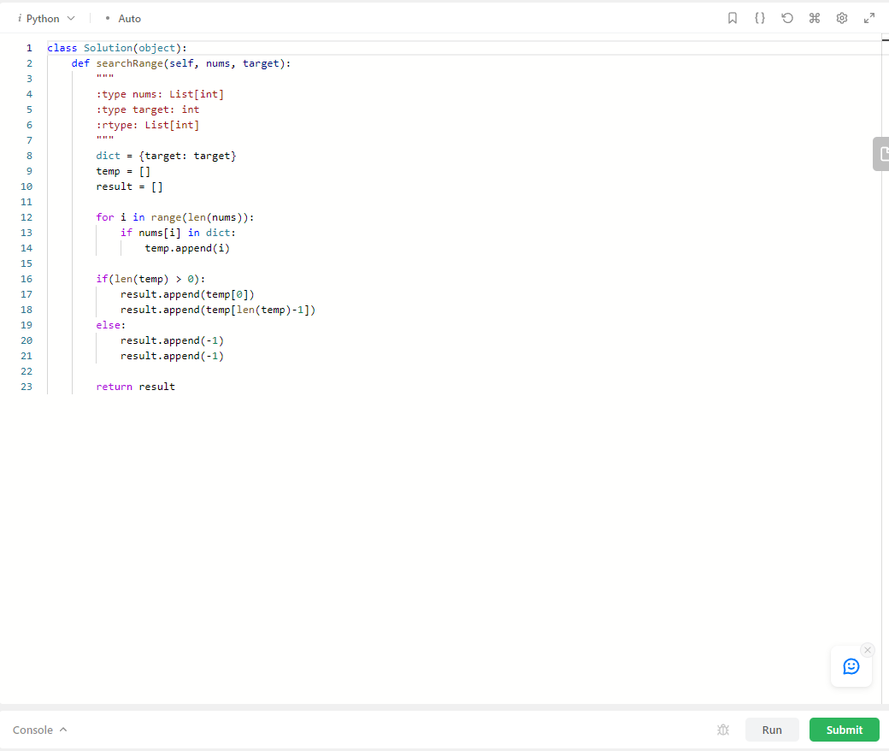

# # 🔥 Find First and Last Position of Element in Sorted Array - 알고리즘 문제(Leet Code)

-  
- <a href="https://leetcode.com/problems/find-first-and-last-position-of-element-in-sorted-array/description/" target="blank">Find First and Last Position of Element in Sorted Array 문제</a>

1. 문제 이해하기
2. 문제 접근하기
3. 문제 코드 작성하기
4. 실행하기   

## 1. 문제 이해하기

<section style="margin:40px 0">
   
  문제에 주어진 integer && 정렬된 배열이 있고, 
  target에 맞는 value의 인덱스를 찾아 시작점과 끝점을 찾으면 되는 문제이다.
</section>

## 2,3,4. 문제 접근하기 > 문제 코드 작성하기 > 실행하기  

- ## 1. Sort --> dictionary

   
  Sorted 된 리스트를 준게 큰 도움이 되었다, 정렬된 리스트을 이용해 
  Dictionary 메모리를 사용해야겠다 바로 생각났기 때문이다.😃 

   
  Dict라는 Dictionary를 만들고 target을 key로 잡고, 
  for문을 돌려서 조건문일때 만족하면 temp(임시) 배열에 넣어주고 
  혹시 주어진 리스트 nums가 빈 리스트 || target에 맞는게 없어서 일때가 있을수 있기때문에 
  temp로 조건을 나누어서 result 리스트에 [-1,-1] 넣어주거나 맨앞, 마지막 인덱스 값을 넣어주는걸로 했다.

  ## 2. 되돌아보기

   
  중간난이도라고 되어있지만, 이번꺼는 굉장히 쉬웠다. 
  정렬로 된 배열로 준게 큰 도움이 되었다. 
  그로인해 Dictionary로 메모리상에 접근해서 풀 생각이 났기때문이다. 
